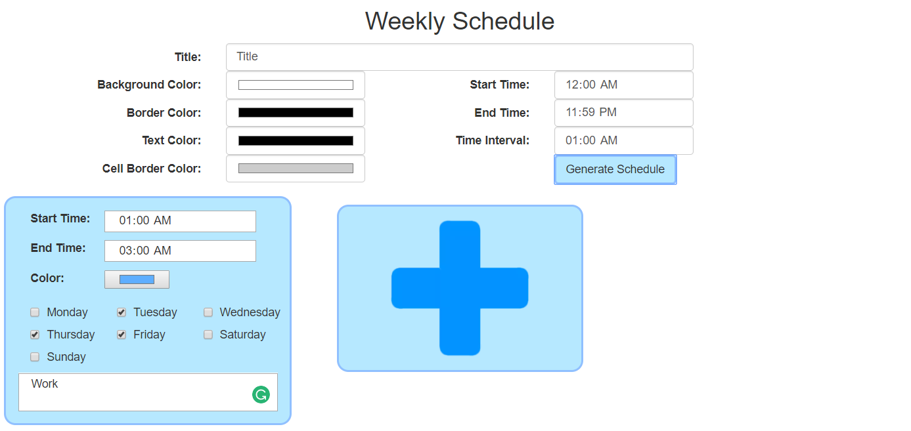
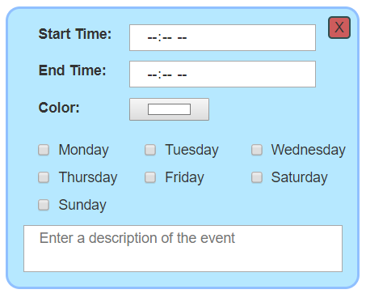
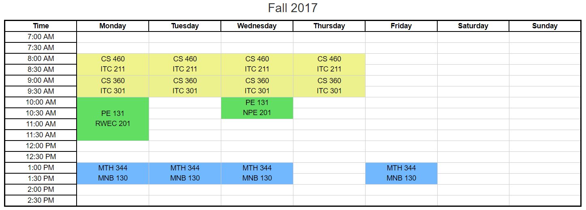

## Homework 2: JavaScript, JQuery

This assignment assigned us with the task of creating a webpage that takes user input and changes the page in some way using the input.
- The assignment page is [here](http://www.wou.edu/~morses/classes/cs46x/assignments/HW2.html).
- The completed assignment can be found [here](http://www.wou.edu/~bbauer15/cs460/homework%202/).
- Repo is [here](https://bitbucket.org/blakebauer/cs460/).

Resources:
+ [W3Schools](https://www.w3schools.com/)
+ HTML CSS and JS interactive cheat sheets [here](http://html-css-js.com/)

Table of contents:
+ [JavaScript](#javascript)
+ [CSS](#jquery)
+ [The Assignment](#the-assignment)

### JavaScript:

JavaScript is a pretty simple language used by webpages and browsers to render dynamic webpages.

JavaScript is dynamically typed. Variables are declared with var. It also doesn't have type errors, operations are unsafe.
```javascript
var x = 5
var y = 3
x = "Moo"
x + y   // = "Moo3"
x - y   // = NaN
[] - {} // = NaN
{} - [] // = -0
{} + [] // = 0
```

JavaScript numbers are all one type. The following are all type Number
```javascript
var x = 1
var y = 1.2
var z = 34e7
```

JavaScript has booleans as well. With all the common conditionals
```javascript
var x = true
var y = false
if(((x || y && true) || 7 == 9) && 1 >= 2){
  x = "I am a string"
}
```

Arrays or lists are defined as usual although they can hold multiple types.
```javascript
var stuff = ["a", 'b', 1, 2, [3, 4]]
```

JavaScript has what are called "objects" which is a list defined by {} with key-value pairs
```javascript
var dog = {
  name: 'Chloe',
  age: 15
}

dog.name == 'Chloe'
dog.age == 15
```

Functions can be assigned to variables and 'moved' around.
```javascript
var x = function(a){
  return a*a;
}

x(2) == 4;
```

JS has standard for loops as well as for/in loops that iterate over keys of an object.
```javascript
for (i = 0; i < 5; i++) {
    x += i*i;
}

var text = '';
for (key in dog) {
  text += dog[key] + " ";
} 
text == 'Chloe 15 '
```
It also has standard while and do while loops.

Built-in Regex W3Schools has a good page [here](https://www.w3schools.com/js/js_regexp.asp).

Running JS in html is done with the script tag.
```html
<script>
      //embedded JS
      element.style.color = "#ff00ff";
</script>

<script src="Some js file.js"></script>
```

Accessing and modifing html elements in js is done in two ways. First, through the document variable.
```javascript
var element = document.getElementById("id_of_element");
element.innerHTML = "New text";
element.style.color = "red";
```

The second is using:

### JQuery

JQuery is a addon for JS that more or less adds the use of CSS selectors to find elements in a minimal syntax fashion.

The basic syntax is $('selector')
```javascript
$('div.container');                     // Returns a list of all divs with class container
$('div.container').style.color = 'red'; // Sets all div.container's color to red
```

JQuery has a nice interface for working with html events.
```javascript
$("button").click(function(){
  $(this).hide();               //this keyword grabs the html element that called the function
});

$("#title").hover(function(){
  //Entered
},
function(){
  //Exited
});
```

JQuery also has the ability to animate CSS properties. !!CSS properties must be camelCased e.g. padding-left = paddingLeft.
```javascript
$('#some_button').click(function(){
  $('#some_div').animate({
    left: '200px',
    width: '100px',
    //Any other css property
  });
});
```

### The Assignment:
For this assignment I made a scheduler where one inputs their events for the week and it generates a nice schedule for them. It has several customization proerties such as color, start time, end time, and time interval. There is a few things I left out like selecting the days and wrapping events from one day to the next.



This is the basic layout. The general schedule options are at the top as well as the generate button.

One of the color pickers followed by the generate button:
```html
<label class="control-label col-sm-2 col-sm-offset-1" for="border_color">Border Color:</label>
<input type="color" class="form-control" name="border_color" value="#000000">

<button type="button" class="btn" id="genBtn" onclick="generateSchedule();">Generate Schedule</button>
```

Each event on the calender is inputted in one of the small blue forms. The page starts with 1 event and more can be added by clicking the plus. After clicking the plus the following will be added and the plus will move over.



Unlike the starting event, the extra ones have an X button which deletes them.

The X button:
```html
<button type="button" class="btn btn_ev_delete col-sm-1" onclick=\'$("#event_n").remove();\'>X</button>
```

The add button:
```html
<button type="button" class="btn" id="addBtn" onclick="addNewCalEvent();">
  
</button>
```

The addNewCalEvent() function is in the js file:
```javascript
function addNewCalEvent() {
    calenderEvents = calenderEvents + 1;
    var newForm = **HTML code for the event form**;
    $("#addbtnform").before(newForm);
}
```
Each event has a id set that is 'event_ + calenderEvents' and calenderEvents is a global variable that is incremented with every new form.

Once the user is satisified with everything they have filled out the generate scheldule button grabs all the input and formats it into a nice table.

First it gets all the input from the top section of the webpage and just stores them in a bunch of variables:
```javascript
//Get all inputs
var title       = $('input[name="title"]')[0].value;
var textcolor   = $('input[name="txt_color"]')[0].value;
var bgcolor     = $('input[name="bgcolor"]')[0].value;
var bordercolor = $('input[name="border_color"]')[0].value;
var cbcolor     = $('input[name="cb_color"]')[0].value;
var beginning   = TimeS($('input[name="start_time"]')[0].value);
var end         = TimeS($('input[name="end_time"]')[0].value);
var interval    = TimeS($('input[name="int_time"]')[0].value);
```

Then we must parse all the events:
```javascript
var eventElements = $("[id^=event_]").toArray(); //Gets all the event forms
var events = [];
var e;

for (e in eventElements) {
	//Check to see if this event has a start and end time
	if (eventElements[e].querySelector('[name="start"]').value == "" || eventElements[e].querySelector('[name="end"]').value == "") {
    	alert("Error: Required event field is not filled out!");
        $("#calender>*").remove();
        return;
    }

	//Gets all the day checkboxes and stores them in a list
    var days = [];
    var checkboxes = eventElements[e].querySelectorAll('input[type="checkbox"]'); 
    var cb;
    for (cb in checkboxes) {
    	days.push(checkboxes[cb].checked);
    }
       
	//Grabs the color and determines to use white text or black for the description
    var temp1 = eventElements[e].querySelector('[name="color"]').value;
    var temp3 = hexToRgb(temp1);
      
    //Awesome brightness formula for swapping between white and black text http://alienryderflex.com/hsp.html
    var temp2 = (Math.sqrt(0.299*temp3.r*temp3.r + 0.587*temp3.g*temp3.g + 0.114*temp3.b*temp3.b) < 128) ? "#ffffff" : "#000000"; 
	//Stores the event in an object for easy use
    var event = {
    	start: TimeS(eventElements[e].querySelector('[name="start"]').value),
        end: TimeS(eventElements[e].querySelector('[name="end"]').value),
        description: eventElements[e].querySelector('[name="description"]').value,
        color: temp1,
        txtc: temp2,
        days: days
    };
    events.push(event);
}
```
    
Then we construct the schedule body as well as the time column:
```javascript
//Add schedule body
$("#calender>*").remove();
var schedule = '<center><h3>' + title + '</h3></center><table  style="color:' + textcolor + ';background-color:' + bgcolor + ';border-color:' + bordercolor + ';"><thead><tr><th>Time</th><th>Monday</th><th>Tuesday</th><th>Wednesday</th><th>Thursday</th><th>Friday</th><th>Saturday</th><th>Sunday</th></tr></thead><tbody></tbody></table>';
$("#calender").append(schedule);

//Calculate number of rows and construct a time to be incremented
var diff = (((end.toMinutes() - beginning.toMinutes()) % 1440) + 1440) % 1440;
var steps = Math.round(diff / interval.toMinutes());
var timeStep = Time(beginning.hours, beginning.minutes);

//Add time column
for (var s = 0; s < steps; s++) {
	$("#calender tbody").append('<tr><td style="border: solid ' + bordercolor + ' 2px">' + timeStep.toString() + "</td></tr>");
	timeStep.addTime(interval.hours, interval.minutes);
}
```

Then we add in all the empty cells and event cells:
```javascript
timeStep = Time(beginning.hours, beginning.minutes); //Incremented to track time
var rows = $("#calender tbody tr"); //Select table rows

//For each day and each time check to see if theres an event if so place one if not place an empty cell
for (var d = 0; d < 7; d++) {
	var added = false;
	for (var s = 0; s < steps; s++) {
		for (var i = 0; i < events.length; i++) {
			if (events[i].days[d] && between(timeStep, events[i].start, events[i].end)) {
				var span = Math.ceil(subTime(events[i].end, timeStep) / interval.toMinutes()) - 1; //Row span of the event

				if (span >= steps - s) { //Don't span past the end of the table
					span = steps - s - 1;
				}

				if (span < 0) { //Error check shouldn't happen anymore but doesn't hurt
					alert("Error: An event is wrapping from one day to the next!");
					$("#calender>*").remove();
					return;
				}

				//Add cell, increment s, and increment time
				$(rows[s]).append('<td rowspan=' + (span + 1) + ' style="color:' + events[i].txtc + ';background-color:' + events[i].color + ';">' + events[i].description + '</td>');
				s = s + span;
				timeStep.addTime(interval.hours * span, interval.minutes * span);
				added = true;
				break;
			}
		}
		if (!added) { //Empty cell
			$(rows[s]).append('<td></td>');
		} else {
			added = false;
		}
		timeStep.addTime(interval.hours, interval.minutes);
	}
	timeStep = Time(beginning.hours, beginning.minutes);
}

//Styles and scroll down
$("#calender").append('<style>td{border: solid ' + cbcolor + ' 1px;} th{border-color: ' + bordercolor + ';}</style>');
document.getElementById("calender").scrollIntoView({behavior: "smooth"});
```

To makes handling time simple there is a couple methods that make time objects, increment time, and determine betweeness:
```javascript
/*
 * Creates a time object with a few methods to prevent mishaps of 25 hours or 63 minutes
 */
function Time(hours, minutes) {
	var t = {
		hours: 0,
		minutes: 0,
		toMinutes: function () {
			return this.minutes + this.hours * 60;
		},
		addTime: function (h, m) {
			this.hours = (this.hours + h + Math.floor((this.minutes + m) / 60)) % 24;
			this.minutes = (m + this.minutes) % 60;
		},
		toString: function () {
			var h = this.hours;
			var s = h >= 12 ? ' PM' : ' AM';
			h = h >= 12 ? h - 12 : h;
			h = h == 0 ? 12 : h;

			return h + ":" + (this.minutes > 9 ? this.minutes : "0" + this.minutes) + s;
		}
	};
	t.addTime(hours, minutes);

	return t;
}

//Parses a string to make a time object
function TimeS(s) {
	var m = s.match(/(\d\d):(\d\d)/);
	return Time(parseInt(m[1]), parseInt(m[2]));
}

/* Subtracts two time objects and returns the minutes
 * Was easier to leave it out of Time object
 */
function subTime(a, b) {
	return (((a.toMinutes() - b.toMinutes()) % 1440) + 1440) % 1440;
}

//Detemines if x is in between s and e
function between(x, s, e) {
	var diff = subTime(e, s) - 1;
	var xdiff = subTime(x, s);
	return xdiff <= diff;
}
```

An example of a finished schedule:
