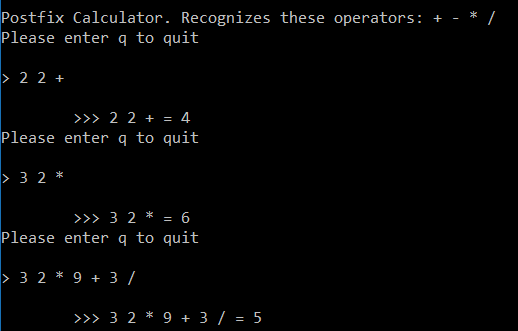

## Assignment 3: C#

[Back](../../)

This assignment assigned us with the task of converting a java application to C#
- The assignment page is [here](http://www.wou.edu/~morses/classes/cs46x/assignments/HW3.html).
- Repo containing the completed assignment is [here](https://bitbucket.org/blakebauer/cs460/).

Table of contents:
+ [C#](#c)
+ [The Assignment](#the-assignment)

### C\#:
C# is a very big language with tons of features. I will not list them all but I will list what I used in this assignment and some other common features.

C# has very similar syntax to that of java but has many differences.

Arrays. C# has the standard arrays. They are initilized with [] and can have explicit initliziation with {}
```cs
char[] cstring = new char[5];
char[] cstring1 = new char[]{'h', 'e', 'l', 'l', 'o'};
char[] cstring2 = {'w', 'o', 'r', 'l', 'd'}
```

It also has several primitive types as well as primitives that are actually an object class.
```cs
int i = 5;
bool b = true;
float f = 1.4f;
double d = 1.4; //System.Double
string s = "Hi"; //System.String
object o; //System.Object
```

C# is object orinated. Classes are the usual with a few differences one being properties.
```cs
class Dog {
	private int age = 5;

	public Dog(){
	
	}
}
```

Properties are a way of writing getters and setters with less code and simpler syntax.
```cs
class Dog {
	public int Age { get; set; } //Auto generated
	
	string name;
	
	public string Name {
		get {
			return name; // Read only explicit definition
		}
	}
}
```

Namespaces are a way of seperating code.
```cs
namespace MyProject {
	class Dog {
		...
	}
}

MyProject.Dog d;

using MyProject
Dog d;
```

Anonymous Types are a way of declaring
```cs
var i = 5; // x is of int type
var s = "bob"; // string
var dog = new {
	Name = "Max",
	Age = 10,
	Owner = "Frank"
}
```


### The Assignment:
This assignment was assigned as practice for C# and working in Visual Studio. It tasked us with taking a java program and converting it to C#.
The program is a console application that functions as a post-fix stack based calculator for basic arthimetic. 



The user inputs numbers and operators. If its a number it pushs it to the stack. If its an operator it pulls the top two elements on the stack and operates on them. Thus, resulting in equations such as 2 2 + = 4 or 4 3 x 2 / = (4x3)/2 = 6.

The program has 3 classes Calculator, LinkedStack, Node and 1 interface IStackADT.

#### Node
Node is a simple class that just stores some data as an object and a next Node. The java implentation uses public fields but in C# we can use properties:
```cs
namespace hw3
{
    class Node
    {
        public object Data { get; set; }
        public Node Next { get; set; }

        public Node()...

        public Node(object data, Node next)...
    }
}
```

#### IStackADT
This is a stack interface that defines several stack methods. It is unneeded for this program buts its could interface practice.
```cs
namespace hw3
{
    interface IStackADT
    {
        object Push(object newItem);
        object Pop();
        object Peek();
        bool IsEmpty();
        void Clear();
    }
}
```

#### LinkedStack
This is an implementation of the IStackADT interface. It has a top Node and operators in a linked structure. Top is private and therefore doesn't need a property although a readonly property could be used in place of Peek().

The push method
```cs
public object Push(object newItem)
{
	if (newItem == null)
	{
		return null;
	}
	Node newNode = new Node(newItem, top);
	top = newNode;
	return newItem;
}
```

#### Calculator
The calculator has 4 methods, 1 being the main. The main method simply loops and calls DoCalulation() until it returns false. DoCalculation gets input from the user and if its not q it sends it to EvaluatePostFixInput in a try catch block.
```cs
private bool DoCalulation()
{
	Console.WriteLine("Please enter q to quit\n");

	string input = "2 2 +";
	Console.Write("> ");

	input = Console.ReadLine();
	if (input.StartsWith("q") || input.StartsWith("Q"))
	{
		return false;
	}
	string output = "4";
	try
	{
		output = EvaluatePostFixInput(input);
	}
	catch (ArgumentException e)
	{
		output = e.Message;
	}
	Console.WriteLine("\n\t>>> " + input + " = " + output);
	return true;
}
```

EvaluatePostFixInput takes a string parameter that is the input from the user. It splits the string into spaces and for each substring check to see if it is a double if so it pushes it to the stack if not it pops two elements off the stack (if there are two) and sends them to DoOperation().
```cs
public string EvaluatePostFixInput(string input)
{
    if (string.IsNullOrEmpty(input))
        throw new ArgumentException("Null or the empty string are not valid postfix expressions.");
		
    stack.Clear();
    string s;
    double a, b, c;
    string[] stuff = input.Split(' ');

    for (int i = 0; i < stuff.Length; ++i)
    {
        try
        {
            double t = Convert.ToDouble(stuff[i]);
            stack.Push(t);	//Push double to stack
        }
        catch (FormatException e)
        {
            s = stuff[i];
            if (s.Length > 1)
                throw new ArgumentException("Input Error: " + s 
						+ " is not an allowed number or operator");

            if (stack.IsEmpty())
                throw new ArgumentException(
						"Improper input format. Stack became empty when expecting second operand.");

            b = Convert.ToDouble(stack.Pop());

            if (stack.IsEmpty())
                throw new ArgumentException(
						"Improper input format. Stack became empty when expecting first operand.");

            a = Convert.ToDouble(stack.Pop());

            c = DoOperation(a, b, s);

            stack.Push(c);
        }
    }
	
	return Convert.ToString(stack.Pop());
}
```

Lastly the DoOperation which takes two double inputs and a string operator. Runs the operator through a switch and if it matchs the support operators it calculates the output.
```cs
public double DoOperation(double a, double b, string s)
{
    double c = 0.0;
    switch (s)
    {
        case "+":
            c = a + b;
            break;
        case "-":
            c = a - b;
            break;
        case "*":
            c = a * b;
            break;
        case "/":
            if (b == 0)
                throw new ArgumentException("Can't divide by zero");
            c = a / b;
            break;
        default:
            throw new ArgumentException(
					"Improper operator: " + s + ", is not one of +, -, *, or /");
    }

    return c;
}
```