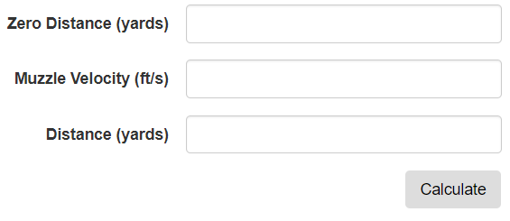

## Assignment 4: ASP.net MVC

[Back](../../)

This assignment gave us the task of making several form pages, using different techniques, to calculate something and return it to the user.
- The assignment page is [here](http://www.wou.edu/~morses/classes/cs46x/assignments/HW4.html).
- Repo containing the completed assignment is [here](https://bitbucket.org/blakebauer/cs460/).

Table of Contents:
+ [Page 1](#page-1)
+ [Page 2](#page-2)
+ [Page 3](#page-3)

#### ASP.net MVC:
ASP.net MVC is a framework used for web development. It has many features and capabilities making development of large webpages much easier.
MVC runs with a model-view-controller pattern. The view is the html webpage which can make use of the razor language allowing it to adjust based on models and databases. Models are the data layer, in a sense, they are used to represent data from a database or something of the like. The models are C# classes. Lastly, the controller, also written in C#, constructs the views and handles the get and post requests. In a sense they send and receive data from the views.

### Page 1
This page we were tasked with making a form that sends the form data through a query string. I choose to make a base converter; converts a number in some base to a different base.

The form takes 3 numbers: the number which is to be converted, its base, and the output base.


The view is rather simple its the corresponding form with a couple plain form groups inside.
```html
<form action="/Home/BaseConvert" method="get">
  ...
</form>
```
The action specifies where the destination is and the method is the http method to be used.

The controller checks if there are any query strings and if there is and they are valid it will convert the number and send it to the view. Which using the razor language can check if they exist and if they do display them.

The views output statement:
```html
<!--Display output if they exist-->
@if (ViewBag.output != null)
{
  <p style="font-size: 24px;">(@ViewBag.input)<sub>@ViewBag.inBase</sub> = (@ViewBag.output)<sub>@ViewBag.outBase</sub></p>
}
```
MVC gives us the Request.QueryString object to allow us to get querystrings and the form appends the querystrings automatically when submitted.

Part of the controller's get action-method:
```cs
public ActionResult BaseConvert() 
{
  //Get input
  string input = Request.QueryString["input"];
  int inBase = Convert.ToInt32(Request.QueryString["inBase"]);
  int outBase = Convert.ToInt32(Request.QueryString["outBase"]);

  //Check to see if we have input
  if (input == null || input == "")
  {
    return View();
  }
  ... //Some more input checking
  ... //Convert the number

  //Send output to the view
  ViewBag.input = input;
  ViewBag.inBase = inBase;
  ViewBag.outBase = outBase;
  ViewBag.output = outputS;
  return View();
}
```

The resulting webpage when we input something valid:


________________________

### Page 2
The second page is basically the same but in the controller we use the FormCollection object to retreive the data. This form calculates bullet drop.

The form:


The view is nearly identical with the last. But the controller method is different.
```cs
[HttpPost]
public ActionResult BulletDrop(FormCollection form)
{
  //Convert input to doubles and check if they are valid
  if (!Double.TryParse(form["velocity"], out double vel) 
    || !Double.TryParse(form["distance"], out double distance)
    || !Double.TryParse(form["sight"], out double sight))
  {
    ViewBag.error = "Inputs could not be parsed";
  }
  else
  {
    //Calculations
  }
  return View();
}
```
There are two action methods for this view since the form is now submitting a post request. The get method simply returns the view. So, unlike page 1, this method is only called when a form is submitted.

An example of it in action:


__________________________

### Page 3
This page like the others is a simple form but the controller method uses model binding instead to retrieve the input. This form calculates loan payments.

The form:


The view is still almost identical to page 1 and 2. But the controller method is much different and much cleaner:
```cs
[HttpPost]
public ActionResult Page3(decimal? amount, decimal? rate, int? length)
{
  if(!(amount == null || rate == null || length == null))
  {
    rate = rate / 100;
    decimal interest = (decimal) (1 - Math.Pow((double) (1 + rate),  - (int) length));
    decimal monthly = ((decimal)amount * (decimal)rate) / interest;
    ViewBag.monthly = monthly;
    ViewBag.total = monthly * length;
  }
  return View();
}
```


An example shot:
