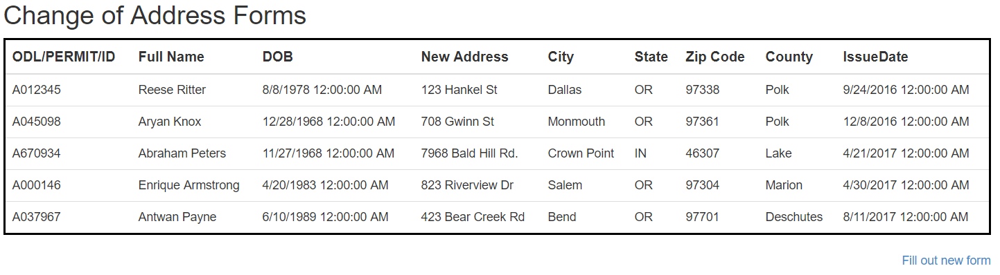
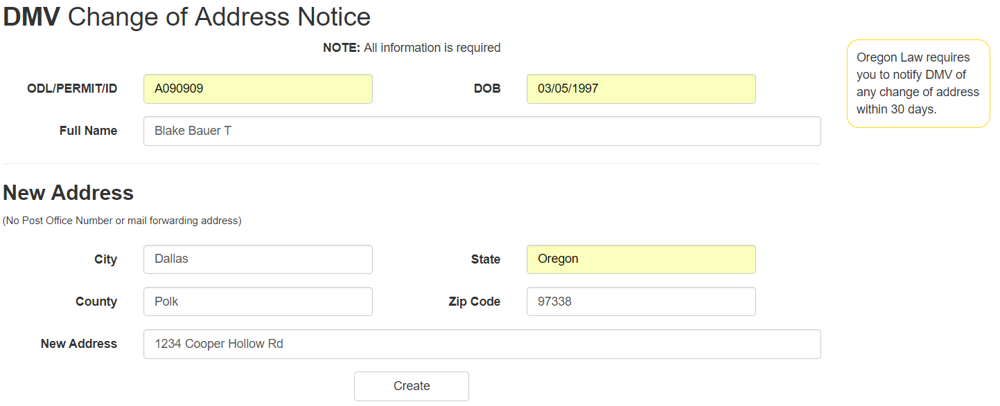
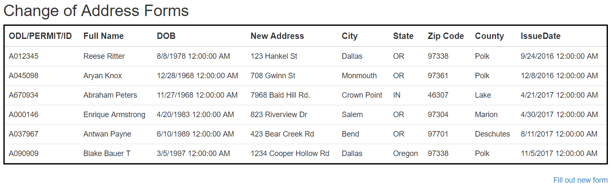

## Assignment 5: MVC App with Simple Database

[Back](../../)

This assignment gave us a form from the dmv and asked for an online copy that submits it to a database.
- The assignment page is [here](http://www.wou.edu/~morses/classes/cs46x/assignments/HW5.html).
- Repo containing the completed assignment is [here](https://bitbucket.org/blakebauer/cs460/).

Table of Contents:
+ [SQL Database](#sql-database)
+ [Model and Context](#model-and-context)
+ [Controller](#controller)
+ [Views](#views)

### SQL Database
First we need to make the database that way we know how to construct the model and views. The form has a total of nine elements along with the primary key that makes ten attributes. 

In order to make the database we were asked to make an up.sql script and a down.sql to construct the table and delete it respectivily

The up script:
```sql
CREATE TABLE dbo.COAs 
(
	ID          INT             IDENTITY (1,1) NOT NULL,
	PermitID    NVARCHAR(32)    NOT NULL,
	FullName    NVARCHAR(128)   NOT NULL,
	DOB         DATETIME        NOT NULL,
	NewAddress  NVARCHAR(256)   NOT NULL,
	City        NVARCHAR(64)    NOT NULL,
	State       VARCHAR(64)     NOT NULL,
	ZipCode     CHAR(10)        NOT NULL,
	County      VARCHAR(64)     NOT NULL,
	IssueDate   DATETIME        NOT NULL,
	CONSTRAINT  [PK_dbo.COA]    PRIMARY KEY CLUSTERED (ID ASC)
);

INSERT INTO dbo.COAs (PermitID, FullName, DOB, NewAddress, City, State, ZipCode, County, IssueDate) VALUES
  // EXAMPLE DATA
```

### Model and Context
The controller uses a model and a context to interact with the database.

The model class represents a row in the table. Each column is represented as a property with the same name; constraints can even be applied.
Snapshot of the model class:
```cs
public class COA
{
  public int ID { get; set; }

  [Required, StringLength(128)]
  [Display(Name = "Full Name")]
  public string FullName { get; set; }

  public DateTime DOB { get; set; }
  
  // etc.
}
```

The context class is very simple. It is a subclass of DbContext and has a DbSet<COA> that represents the database.
```cs
public class COAContext : DbContext
{
  public COAContext() : base("name=OurDBContext")
  { }

  public virtual DbSet<COA> COAs { get; set; }
}
```

### Controller
The controller is fairly straight forward. It contains a private COAContext, used for interacting with the database, as well as action methods which send the database to the views and write to the database on a form post.

Sending the database to the View to be listed is as simple as:
```cs
return View(db.COAs.ToList());
```

Adding a row to the database is a bit more complicated. We can use model binding to receive a construct COA object from our strongly typed view. Then we can check if its valid, do anything else to it, then send it off to the database and redirect back to the index page.
```cs
[HttpPost]
[ValidateAntiForgeryToken]
public ActionResult Form([Bind(Include = 
  "ID,PermitID,FullName,DOB,NewAddress,City,State,ZipCode,County")] COA coa)
{
  if (ModelState.IsValid)
  {
    coa.IssueDate = DateTime.Today;
    db.COAs.Add(coa);
    db.SaveChanges();
    return RedirectToAction("Index");
  }

  return View(coa);
}
```

Lastly we have to 'dispose' of the context class or they might clog up the system:
```cs
protected override void Dispose(bool disposing)
{
  if (disposing)
  {
    db.Dispose();
  }
  base.Dispose(disposing);
}
```

### Views
The views are quite full of razor syntax but it really makes it less of a headache to keep track of input name and such.

The Index page lists all the elements of the database. It is quite simple, we first have to type it to a IEnumerable<COA> so it can work with a list. Then it is just making a table.
```html
@model IEnumerable<hw5.Models.COA>

<table class="table" style="border: 3px solid black;">
    <thead>
        <tr>
            <th>@Html.DisplayNameFor(model => model.PermitID)</th>
            <th>@Html.DisplayNameFor(model => model.FullName)</th>
            ...
            <th>@Html.DisplayNameFor(model => model.IssueDate)</th>
        </tr>
    </thead>
    <tbody>
        <!--Lists all the item in the database-->
        @foreach (var item in Model)
        {
            <tr>
                <td>@Html.DisplayFor(modelItem => item.PermitID)</td>
                <td>@Html.DisplayFor(modelItem => item.FullName)</td>
                ...
                <td>@Html.DisplayFor(modelItem => item.IssueDate)</td>
            </tr>
        }
    </tbody>
</table>
```

And here is what the view looks like:


Razor really makes this quite easy. The foreach loop will just add that section of html for each item in whatever list is based in.

The form view is much more complex. Just like before we type the view to the COA class. Then we have to go about constructing the form which uses a lot of razor.

The form with just one form-group.
```html
@using (Html.BeginForm())
{
  @Html.AntiForgeryToken()

  <div class="form-horizontal">
    @Html.ValidationSummary(true, "", new { @class = "text-danger" })
    <!-- PermitID form group -->
    <div class="form-group col-md-6">
      @Html.LabelFor(model => model.PermitID, htmlAttributes: new { @class = "control-label col-md-4" })
      <div class="col-md-8">
        @Html.EditorFor(model => model.PermitID, new { htmlAttributes = new { @class = "form-control" } })
        @Html.ValidationMessageFor(model => model.PermitID, "", new { @class = "text-danger" })
      </div>
    </div>
    ... //Several more form-groups
  </div>
}
```

Here is the form with an example filled out:


And after it is submitted we can see it in the list:
