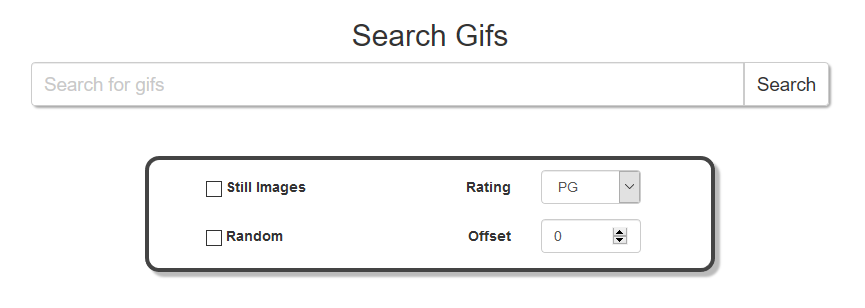

## Assignment 7: AJAX and Restful APIs

[Back](../../)

We are given the task of creating a dynamic webpages using ajax to request images from giphy's api and log all the requests we make into a database. 
- The assignment page is [here](http://www.wou.edu/~morses/classes/cs46x/assignments/HW6.html).
- Repo containing the completed assignment is [here](https://bitbucket.org/blakebauer/cs460/).

Table of Contents:
+ [Function](#function)
+ [Javascript](#javascript)
+ [Controller](#controller)
+ [Database](#database)

### Function

To start here is the webpage:

 

The user inputs a search selects the different settings they want and then clicks search. Which will send an ajax request to a controller which will then send a request to giphy for whatever specified. The controller forms a json object and sends it back to the browser which then modifies the DOM and renders them on the page.


Options:
+ Still images - determines if the images returned should be animated or not.
+ Rating - Sets giphy's rating option as to filter out unwanted content.
+ Random - Whether to grab from giphies random api. Disables offset option.
+ Offset - What 'page' should the images be grabbed from. In order to get different images this needs to be changed or random needs to be checked.

### Javascript

```js
function search() {
  var a = $.ajax({
    type: "GET",
    dataType: "json",
    url: "search/giphy",
    data: {
      tags: $("#searchtext")[0].value,
      // sends stuff to controller - rating, offset, etc.
    }
  }).done(function () {
    a.responseJSON.forEach(function (i, index) {
      var images = $("#images div img");
      if (images.length > 5) {
        images[index].src = i; // If the images exist already
      } else {
        // If images elements don't exist
        $("#images").append(`<div class="col-md-4"></ div>`);
      }
    })
  });
}
```

When the search button is clicked it calls the search() function. Which sends out an ajax request to the controller specificed in url. The data parameter is all the options for the search which get mapped to parameters in the controller method. Then when the ajax method is done it calls the anoymous function which for each element in the response json it ether adds a new image element or modifies an existing one.

### Controller
The controller takes the search parameters sends them to giphy and returns a list of 6 images as a json object.

```cs
string apiKey = System.Web.Configuration.WebConfigurationManager.AppSettings["GiphyApiKey"];

using (WebClient w = new WebClient())
{
  string jsondata = "";
  string[] images = new string[6];

  try
  {
    if (random)
    {
      for (int i = 0; i < 6; i++)
      {
        // Send request to giphy
        jsondata = w.DownloadString(
            $"https://api.giphy.com/v1/gifs/random
                  ?api_key={apiKey}&tag={tags}&rating={rating}");
        
        // Deserialize Json to a dynamic object
        dynamic json = new JavaScriptSerializer().DeserializeObject(jsondata);
        
        // Construct the returned object
        if (still)
          images[i] = (json["data"]["image_original_url"] as string)
                      .Replace("giphy.gif", "200_s.gif");
        else
          images[i] = (json["data"]["image_original_url"] as string)
                      .Replace("giphy.gif", "200.gif");
      }
    } else {
        // Send similar request to giphy search api
    }
  } catch (Exception e) {  }
  
  return Json(images, JsonRequestBehavior.AllowGet);
}
```

The controller also creates a request object and adds it to the database.
```cs
using(RequestsContext db = new RequestsContext())
{
  Request req = new Request {
    RequestDate = DateTime.Today,
    Tags        = tags,
    IsRandom    = random,
    Rating      = rating,
    IsMobile    = Request.Browser.IsMobileDevice,
    IPAddress   = Request.UserHostAddress,
    UserAgent   = Request.UserAgent
  };

  db.Requests.Add(req);
  db.SaveChanges();
}
```

It also uses a custom route since the controller's name is AJAXController but we are accessing it in ajax with search/giphy
```cs
routes.MapRoute(
    name: "Search",
    url: "search/giphy",
    defaults: new { controller = "AJAX", action = "Search"}
);
```

### Database
The database is a one table no relation database constructed with the following
```sql
CREATE TABLE dbo.Requests 
(
	ID				INT				IDENTITY (1,1) NOT NULL,
	Tags			NVARCHAR(255)	NOT NULL,
	IsRandom		BIT				NOT NULL,
	Rating			NVARCHAR(8)		NOT NULL,
	RequestDate		DATETIME		NOT NULL,
	IsMobile		BIT				NOT NULL,
	IPAddress		NVARCHAR(255)	NOT NULL,
	UserAgent		NVARCHAR(255)	NOT NULL,
	CONSTRAINT  [PK_dbo.Requests]    PRIMARY KEY CLUSTERED (ID ASC)
);
```

And we can see after searching for frogs it appears in our db
