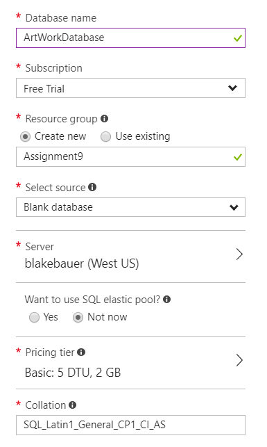
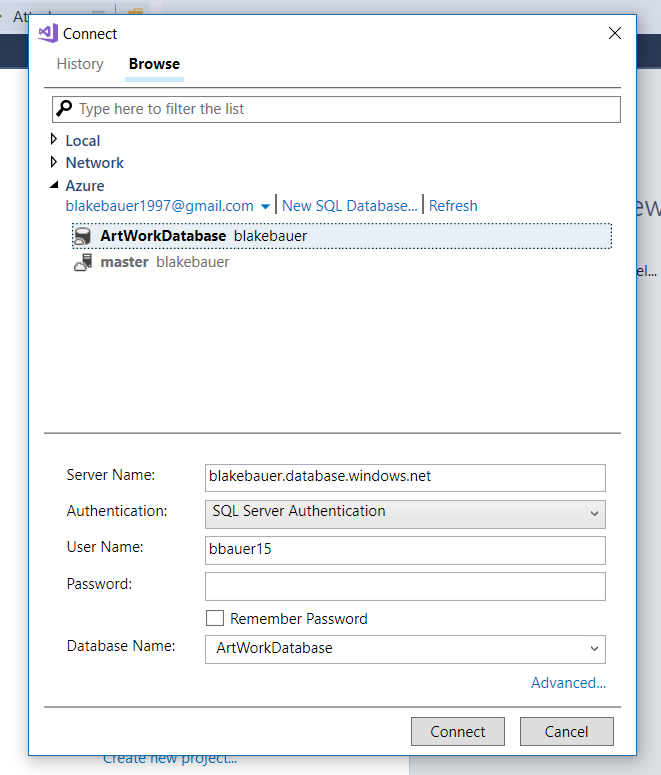
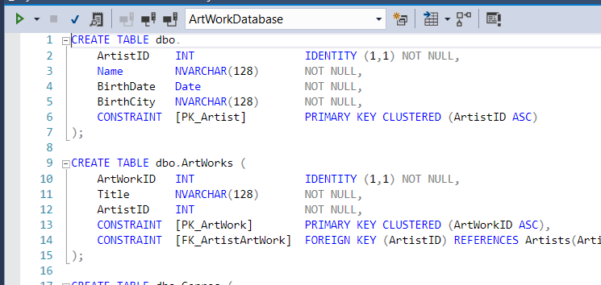
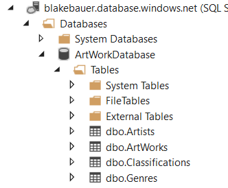
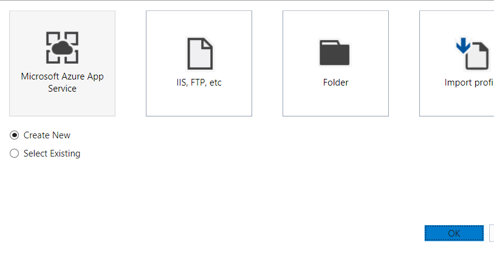
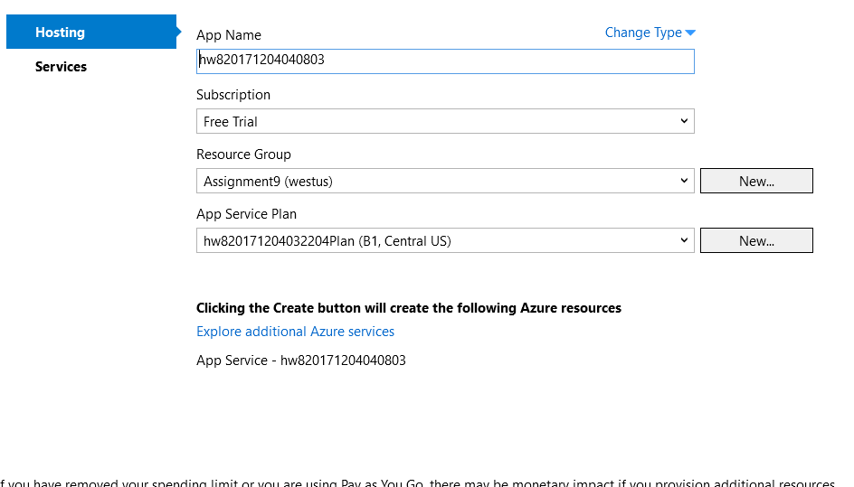
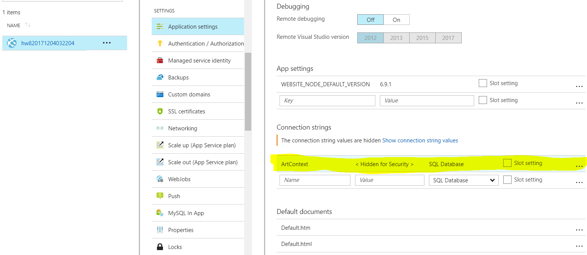
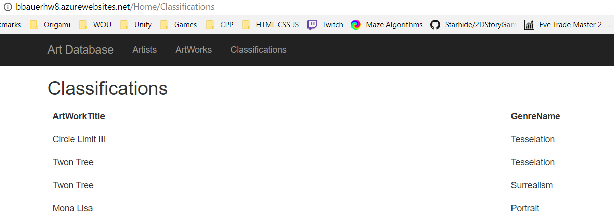

## Assignment 9: Azure Deployment

[Back](../../)

This assignment has us publish HW8 on Azure.
- The assignment page is [here](http://www.wou.edu/~morses/classes/cs46x/assignments/HW9.html).
- The azure page can be found [here](http://bbauerhw8.azurewebsites.net)

1. First we have to create the database on azure. Select SQL Databases click the add button and go through everything so the settings might look like this:

2. Next we connect the database to Visual Studio. There is a button in Azure that opens a connection window in visual studio:

Then we can run the db-up script:

Which should populate all the tables:

5. Either create a App Service in Azure or go straight to publishing. Select the publish button in the right-click menu on the project. And select azure and click create new. Which should fill in some stuff. Set whatever you want and click publish.

6. Add connection string to Azure App Service. Which can be found in the database

7. Test!!
